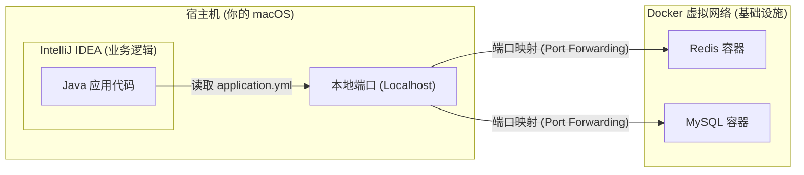

# Docker Compose 核心指南：本地环境的"指挥官"

在 Java 后端开发中，我们很少在物理机上安装 MySQL 或 Redis，而是通过 Docker Compose 快速拉起一套隔离的中间件环境。

## 1. 为什么需要它？

- **环境一致性**：你的同事只需要执行一行命令，就能拥有和你一模一样的 DB 版本和配置。
- **一键编排**：自动处理容器间的依赖关系（比如先启动 DB，再启动应用）。
- **网络隔离**：Compose 会创建一个默认网络，容器间可以通过 `服务名`（如 `host: mysql`）直接通讯，不需要通过本地 IP。

## 2. 核心指令速查表

| 指令                               | 描述                     | Node.js 对标                     |
| :--------------------------------- | :----------------------- | :------------------------------- |
| `docker-compose up -d`             | 创建并拉起所有定义的服务 | `pm2 start ecosystem.config.js`  |
| `docker-compose down`              | 停止并移除容器、网络     | `pm2 stop all && pm2 delete all` |
| `docker-compose logs -f [service]` | 实时查看日志             | `pm2 logs`                       |
| `docker-compose restart [service]` | 重启指定服务             | `pm2 restart [id]`               |
| `docker-compose exec [service] sh` | 进入容器内部执行命令     | `ssh` 进入服务器                 |

## 3. 在 java-labs 中的实践：详解配置字段

让我们以项目中的 `docker-compose.yml` 为例，拆解其核心字段的含义：

### MySQL 服务配置

```yaml
mysql:
  image: mysql:8.0 # 使用镜像版本，对标 package.json 中的依赖版本
  container_name: ja-mysql # 容器名，这对你在终端执行 `docker exec -it` 非常重要
  environment: # 环境变量：定义数据库启动时的初始配置
    MYSQL_ROOT_PASSWORD: root # 设置 root 密码
    MYSQL_DATABASE: java_labs # 启动时自动创建一个名为 java_labs 的数据库
  ports: # 核心！端口映射 [宿主机端口:容器内端口]
    - '3306:3306' # 这里的 3306 让你的 IDEA 代码可以连接 localhost:3306
  volumes: # 数据持久化，将宿主机目录挂载到容器内部
    - ./mysql_data:/var/lib/mysql
```

### Redis 服务配置

```yaml
redis:
  image: redis:7-alpine # 'alpine' 是极简版 Linux，镜像体积非常小
  container_name: ja-redis
  restart: always # 意外关机后自动重启
  ports:
    - '6379:6379' # 让你的 RedisTemplate 可以连接 localhost:6379
  volumes:
    - ./redis_data:/data # 保证你 Redis 里的数据在重启后不会丢失
```

### 关键字段深度剖析 (Node.js 视角)

1.  **`image` (镜像)**:
    - _类比_：`node:18`。镜像包含了 OS + 运行环境 + 软件本身。
2.  **`ports` (端口映射)**:
    - _理解_：容器是一个"封闭的小盒子"。如果不做 `ports` 映射，宿主机（你的 macOS）是看不到 3306 或 6379 端口的。
    - _左侧_ 是你从外部（IDEA、TablePlus、RedisInsight）访问的端口。
    - _右侧_ 是容器内服务监听的端口。
3.  **`volumes` (数据卷)**:
    - _痛点_：默认情况下，容器一旦销毁，里面的数据也随之烟消云散。
    - _解决_：我们将宿主机的 `./mysql_data` 与容器内的 `/var/lib/mysql` "绑定"。这样 MySQL 写入磁盘的所有数据实际上都存到了你的电脑硬盘上。
4.  **`networks` (网络)**:
    - _进阶_：多个容器会自动加入同一个。在同一个网络下，Java 应用可以通过 `mysql:3306` 直接访问服务，而不仅仅是 `localhost`。

---

## 4. 核心认知：Docker Compose 与 IDEA 调试的关系

这是初学者最容易产生疑惑的地方。为什么不把 Java 应用也塞进 Docker？为什么要在外面用 IDEA 跑？

### 架构示意图



### 协作原理：

1. **基础设施托管 (Docker Compose)**：
   我们通过 `docker compose up -d` 启动 Redis。Docker 会在你的 macOS 上"占住" `6379` 端口，并将发往这个端口的所有流量转发给容器内的 Redis 进程。
2. **业务代码运行 (IDEA)**：
   你在 IDEA 里点运行。Java 代码读取 `application.yml` 发现 Redis 地址是 `localhost:6379`。于是它向自己电脑的 6379 端口发请求。
3. **成功对接**：
   Java 应用以为自己在访问本地软件，实际上流量通过 Docker 的**端口映射层**精准地命中了容器内的服务。

### 这种模式的 3 大优势：

1. **零重启断点调试**：你可以在 IDEA 里给 Java 代码打断点，程序会瞬间停住。如果 Java 也在 Docker 里，调试配置会极其复杂且缓慢。
2. **热加载 (Hot Swap)**：你修改了一个 Java 方法的逻辑，IDEA 几秒内就能同步到正在运行的应用中。而在 Docker 里，你得重新构建镜像（可能需要几分钟）。
3. **环境一次性预置**：你不再需要手动在 Mac 上安装各种数据库。只需要一份 `docker-compose.yml`，你的电脑就永远保持整洁，只有代码，没有"垃圾"。

> [!important]
> **黄金法则**：
>
> - **不变的/复杂的/标准的**（如 DB、Redis）放进 `docker compose`。
> - **正在写的/经常改的/需要调的**（如 Java 业务代码）留在 `IDEA` 运行。

> [!important]
> **数据持久化建议**：永远不要删除项目中的 `mysql_data` 或 `redis_data` 文件夹，除非你想重置数据库。

## AI 辅助开发实战建议 (AI-assisted Development Suggestions)

手动编写复杂的 Compose 文件容易出现缩进错误。

> **最佳实践 Prompt**:
> "我需要为一个 Spring Boot 项目增加一个『消息队列』环境。
>
> 1. 请帮我在现有的 `docker-compose.yml` 中增加 `RabbitMQ` 服务，并开启管理后台（端口 15672）。
> 2. 请设置数据持久化路径，确保队列消息在重启后依然存在。
> 3. 请说明如何在 `application.yml` 中配置连接地址，利用 Compose 的服务名发现机制（如果 Java 应用也跑在 Docker 里的情况）。"

---

## 2-3 条扩展阅读 (Extended Readings)

1. [Docker Compose Spec](https://docs.docker.com/compose/compose-file/) - 官方配置字典。
2. [Play with Docker](https://training.play-with-docker.com/) - 在线练习 Docker 的沙盒环境。
3. [Dzone: Docker for Java Developers](https://dzone.com/articles/using-docker-for-java-development) - 深度解析 Java 开发者为何离不开 Docker。
